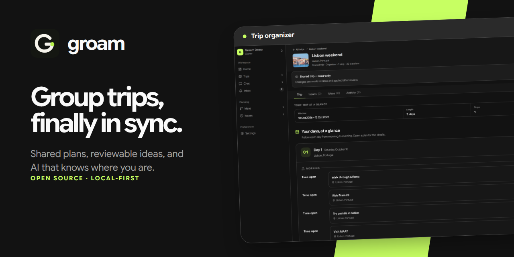

<p align="center">
  <picture>
    <source media="(prefers-color-scheme: dark)" srcset="packages/brand/assets/lockup-dark.svg">
    <source media="(prefers-color-scheme: light)" srcset="packages/brand/assets/lockup-light.svg">
    
  </picture>
</p>

<p align="center"><strong>One live workspace for the whole trip.</strong></p>

Plan group trips together without losing decisions in scattered chats and
spreadsheets. Groam combines shared itineraries, reviewable proposals, issues,
trip chat, and screen-aware AI in one workspace.



## See Groam in action

<video src="https://github.com/nicksan222/groam/raw/refs/heads/main/tooling/showcase/artifacts/showcase.mp4" controls title="Planning a Lisbon trip together with Groam"></video>

[Watch the 3:52 showcase in full resolution](tooling/showcase/artifacts/showcase.mp4).
It follows two travelers as they plan a Lisbon weekend from the first idea to
an agreed itinerary.

## What you can do

- **Build a shared itinerary.** Organize destinations, dates, activities, notes,
  and trip covers in one live plan.
- **Propose before changing the plan.** Package itinerary edits into ideas that
  others can inspect, approve, and apply.
- **Turn feedback into action.** Open issues for changes, link them to proposals,
  and close them automatically when the approved fix is applied.
- **Keep trip conversations together.** Start group chats tied to a trip, reply
  in real time, and react to messages.
- **Plan with context-aware AI.** Ask the assistant about the screen and trip you
  are viewing, review itineraries, and use specialized issue and idea agents.
- **Choose where your data runs.** Use an entirely local Convex backend, package
  Groam as a desktop app, or deploy it to Convex Cloud.

AI supports OpenAI, Anthropic, Google, OpenRouter, and local OpenAI-compatible
providers such as Ollama. Group API keys stay private to the active workspace.

## Develop locally

You need [Bun](https://bun.sh) 1.3.11, Node.js 24, and
[`just`](https://just.systems). No Convex account is required.

```bash
just install
just dev
```

In another terminal, load the demo workspace:

```bash
just seed
```

Open [http://localhost:5173](http://localhost:5173) and sign in with
`demo@groam.example` / `GroamDemo123!`.

Useful commands:

| Command | Purpose |
| --- | --- |
| `just check` | Run the complete CI quality suite |
| `just test` | Run unit and integration tests |
| `just e2e-local` | Run Playwright against the local app |
| `just desktop` | Start desktop development |
| `just showcase` | Rebuild the scripted 4K showcase |

See [CONTRIBUTING.md](CONTRIBUTING.md) for conventions and setup details. See
[`packages/backend/convex/README.md`](packages/backend/convex/README.md) for
Convex Cloud deployment.

## License

Groam is available under the [MIT License](LICENSE).
