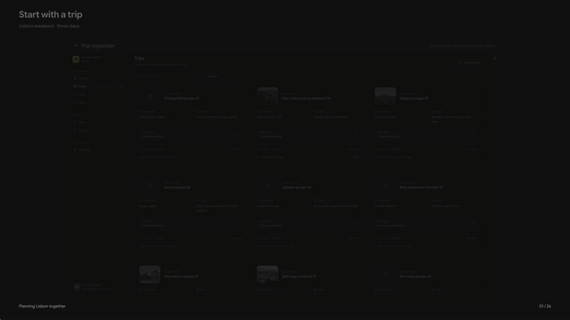

<div align="center">

<picture>
  <source media="(prefers-color-scheme: dark)" srcset="packages/brand/assets/lockup-dark.svg">
  <source media="(prefers-color-scheme: light)" srcset="packages/brand/assets/lockup-light.svg">
  
</picture>

**A shared place for group trips, from first idea to agreed itinerary.**

Plan together without losing decisions across chats and spreadsheets. Groam
brings live itineraries, reviewable proposals, issues, trip conversations, and
screen-aware AI into one workspace.

[Explore the features](#built-for-planning-together) | [Run it](#run-groam) | [Community](#community)

</div>

<a href="tooling/showcase/artifacts/showcase.mp4">
  
</a>

<p align="center">
  <sub>Two travelers take a Lisbon weekend from an idea to a shared plan. <a href="tooling/showcase/artifacts/showcase.mp4">Watch the complete 3:59 showcase in 4K.</a></sub>
</p>

## Built for planning together

| | |
| --- | --- |
| **Live trip plans** | Organize destinations, dates, activities, notes, and trip covers in one shared itinerary. |
| **Reviewable ideas** | Package changes into proposals that travelers can inspect, approve, revise, and apply. |
| **Issues that resolve** | Turn feedback into tracked work and close an issue automatically when its linked fix lands. |
| **Trip conversations** | Keep group chats, replies, and reactions beside the trip they belong to. |
| **Context-aware AI** | Ask about the trip and screen in view, review itineraries, and work with specialized issue and idea agents. |
| **Local-first development** | Run the web app and Convex backend locally without a cloud account, or package the same app for desktop. |

Groam supports OpenAI, Anthropic, Google, OpenRouter, and local
OpenAI-compatible providers such as Ollama. Provider keys are scoped to the
active workspace.

## How it fits together

```text
TanStack Router + React                    Tauri desktop shell
             |                                    |
             +----------- shared Groam UI --------+
                              |
                    reactive Convex backend
                              |
             auth | trips | ideas | issues | chat | AI
```

The monorepo keeps the web and desktop clients thin while sharing UI, auth,
AI contracts, and a type-safe Convex backend. The complete stack can run on one
machine; Convex Cloud deployment is optional.

## Run Groam

[](https://codespaces.new/nicksan222/groam?quickstart=1)

The checked-in [dev container](.devcontainer/devcontainer.json) is the development
environment and source of truth. Open the repository in GitHub Codespaces or
choose **Dev Containers: Reopen in Container** locally; the toolchain and
dependencies are provisioned automatically, including a private local Graphify
code index for agent and developer search.

From a host terminal, start it and run commands through the Dev Container CLI:

```bash
.devcontainer/devcontainer up
.devcontainer/devcontainer exec just dev
```

Git may run on the host; all repository tooling runs in the container. On a
clean host, run the containerized `just check` gate before committing with
`git commit --no-verify`, so Husky does not launch project tools on the host.
The launcher delegates to the official Dev Container CLI and automatically
handles Git metadata stored outside Codex and other Git worktrees.
When already attached to the container or using Codespaces, run `just dev`
directly.

```bash
just dev
```

In another terminal, seed the demo workspace:

```bash
just seed
```

Open [localhost:5173](http://localhost:5173) and sign in with
`demo@groam.example` / `GroamDemo123!`.

## Work on Groam

| Command | Purpose |
| --- | --- |
| `just check` | Run the complete CI quality suite |
| `just test` | Run unit and integration tests |
| `just e2e-local` | Run Playwright against the local app |
| `just desktop` | Start desktop development |
| `just graphify-query "…"` | Search code relationships in plain language |
| `just graphify-refresh` | Refresh the local code graph after edits |
| `just showcase` | Rebuild the scripted 4K product film |
| `just showcase-gif` | Rebuild the full-length 1080p README preview from the committed film |

See [CONTRIBUTING.md](CONTRIBUTING.md) for the container workflow and project
conventions. The [showcase guide](tooling/showcase/README.md) explains the
reproducible Playwright and Remotion film pipeline. For deployment details, see the
[Convex backend guide](packages/backend/convex/README.md).

## Community

Contributions are welcome. Read the [contribution guide](CONTRIBUTING.md), ask
for help through [SUPPORT.md](SUPPORT.md), and follow the
[Code of Conduct](CODE_OF_CONDUCT.md). Report security vulnerabilities privately
as described in [SECURITY.md](SECURITY.md).

Project governance and current maintainers are documented in
[MAINTAINERS.md](MAINTAINERS.md).

## License

Groam is open source under the [MIT License](LICENSE).
